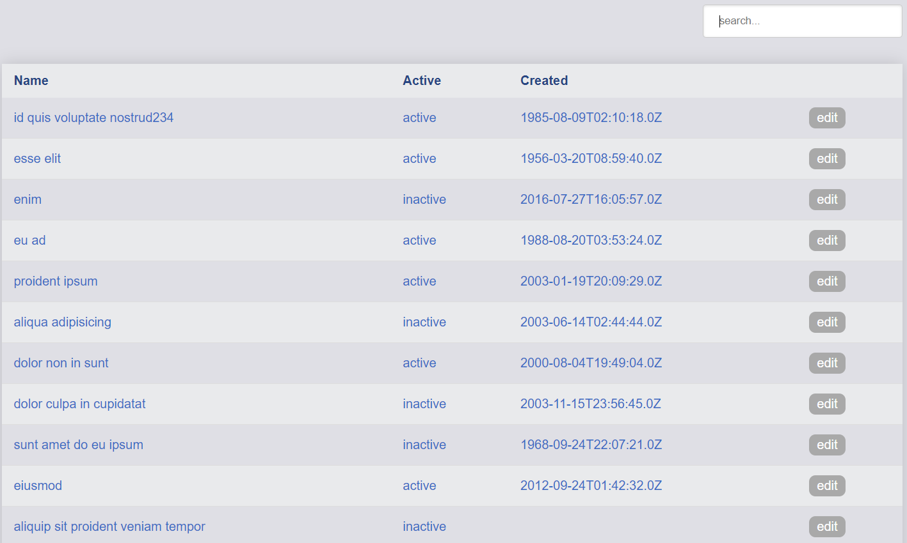
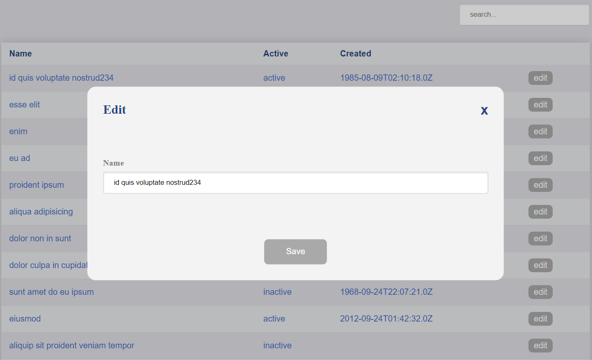

# filtered-list-ts-test-task

Тестовое задание

Есть несколько видов данных, которые необходимо отобразить их и фильтровать по текстовым полям.
При нажатии на кнопку Edit, должна быть реализована возможность обновлять данные в модальном окне, 
которые при сохранении обновляют данные в таблице. 
Должны быть использованы возможности TypeScript.

Ссылка на прод: https://filtered-list-ts-test-task.vercel.app/

Стэк: TypeScript, React, Redux-Toolkit, Redux, Thunk,  HTML, CSS

# Скриншоты

